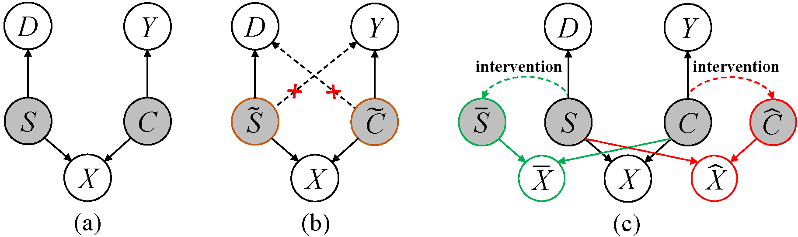

## [HOOD: Harnessing Out-Of-Distribution Examples via Augmenting Content and Style](https://openreview.net/pdf?id=boNyg20-JDm)




This is an PyTorch implementation of HOOD.
This implementation is based on [Pytorch-FixMatch](https://github.com/kekmodel/FixMatch-pytorch) and [OpenMatch](https://github.com/VisionLearningGroup/OP_Match).


## Requirements
- python 3.6+
- torch 1.4
- torchvision 0.5
- tensorboard
- numpy
- tqdm
- sklearn
- apex (optional)

See [Pytorch-FixMatch](https://github.com/kekmodel/FixMatch-pytorch) for the details.

## Usage

### Dataset Preparation
This repository needs CIFAR10, CIFAR100, or ImageNet-30 to train a model.

To fully reproduce the results in evaluation, we also need SVHN, LSUN, ImageNet
for CIFAR10, 100, and LSUN, DTD, CUB, Flowers, Caltech_256, Stanford Dogs for ImageNet-30.
To prepare the datasets above, follow [CSI](https://github.com/alinlab/CSI).


```
mkdir data
ln -s path_to_each_dataset ./data/.

## unzip filelist for imagenet_30 experiments.
unzip files.zip
```

All datasets are supposed to be under ./data.

### Train
Train the model by 50 labeled data per class of CIFAR-10 dataset:

```
sh run_cifar10.sh 50 save_directory
```

Train the model by 50 labeled data per class of CIFAR-100 dataset, 55 known classes:

```
sh run_cifar100.sh 50 10 save_directory
```


Train the model by 50 labeled data per class of CIFAR-100 dataset, 80 known classes:

```
sh run_cifar100.sh 50 15 save_directory
```


Run experiments on ImageNet-30:

```
sh run_imagenet.sh save_directory
```


### Evaluation
Evaluate a model trained on cifar10

```
sh run_eval_cifar10.sh trained_model.pth
```


### Acknowledgement
This repository depends a lot on [Pytorch-FixMatch](https://github.com/kekmodel/FixMatch-pytorch) for FixMatch implementation, and [CSI](https://github.com/alinlab/CSI) for anomaly detection evaluation, and [OpenMatch](https://github.com/VisionLearningGroup/OP_Match) for Open Classifier implementation. 
 Appreciate their contributions.

### Reference
If you find this code helpful, please consider cite our paper, thanks.

```
@inproceedings{huang2023harnessing,
  title={Harnessing Out-Of-Distribution Examples via Augmenting Content and Style},
  author={Zhuo Huang and Xiaobo Xia and Li Shen and Bo Han and Mingming Gong and Chen Gong and Tongliang Liu},
  booktitle={The Eleventh International Conference on Learning Representations },
  year={2023},
  url={https://openreview.net/forum?id=boNyg20-JDm}
}
```

